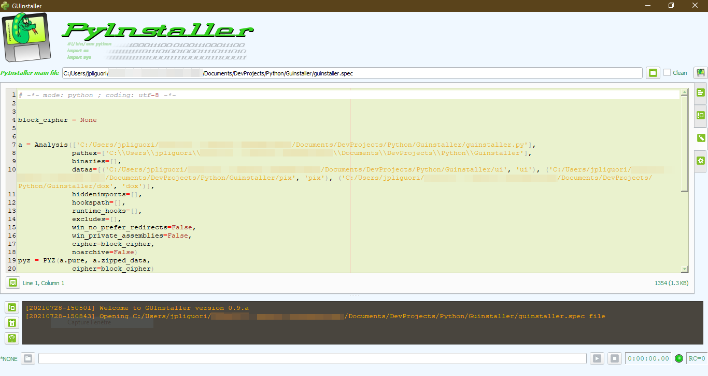
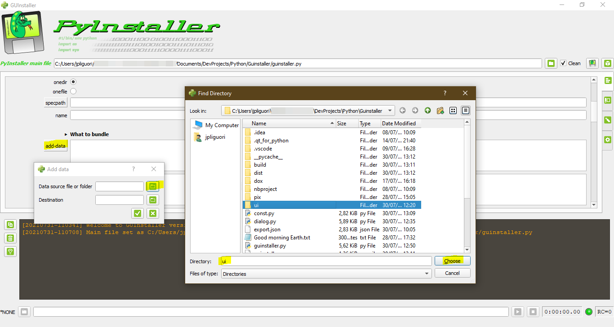

# GUInstaller | *An user friendly frontend to PyInstaller*

## Summary
- **GUInstaller** is my proposition for an user friendly frontend to the *PyInstaller* program which allows you to package your Python scripts into a binary natively runnable executable.
- **GUInstaller** has been tested successfully on Windows and Linux computers. I think (and hope) it will running well on Mac OS X boxes.
- **GUInstaller** is not affiliated nor endorsed to the PyInstaller's development team. It's a personal project which had the main goal to help me to build easily standalone scripts and I decided to share it with the community.

## Built with
- [Python](https://www.python.org)
- [PyQt5 library](https://pypi.org/project/PyQt5/)
- [Axialis free icons library](http://www.axialis.com/free/icons) by [Axialis Team](http://www.axialis.com)

## Authors
- Main developer : [**J.-P. Liguori**](http://www.ozf.fr/#guinstaller)

## License
- This project is licensed under the GNU General Public License.
- See the [LICENSE.md](LICENSE.md) file for details.

## Features
- Convivial user interface with tooltips.
- Embedded PyInstaller documentation.
- Entry point from main Python script or previously generated spec file.
- Spec file editor with syntax highlighter.
- Real time log and compilation results.
- Generated binary runnable directly from the GUI for testing purposes.
- Customizable GUI colors.

## Requirements
- Python 3.x
- PyInstaller
- PyQt5 libraries
- TinyAES if you wish to use the PyInstaller's obsfucation feature

## Screenshots
- Main screen

- Spec file editor

- Compiled script ready to be run

- Interface in dark mode

## Installation
* Assuming you meet the requirements (see Requirements), otherwise, you'll need to perform at least these commands :

        $ pip3 install pyqt5
        $ pip3 install pyinstaller

* Now, we will download the sources by cloning the **GUInstaller** repository into your home folder :

       $ git clone https://github.com/jplozf/guinstaller

* Change to the new created folder and launch the GUI :

       $ cd guinstaller
       $ python3 guinstaller.py

    

* Now the GUI is up and running, we'll use it to compile itself as a binary for your system. This will serve as a concrete example of how to use it.

## Tutorial

_This is a tutorial about using GUInstaller, not a tutorial about using PyInstaller. I suppose you are fluent with the main PyInstaller's options. In case of doubt, the last PyInstaller documentation is provided and accessible by clicking the lightbulb button near the log panel._

* Open the main file we'll use for building our binary; here we will build the binary directly from the source files. We will see later how to use a previously generated spec file already configured. So for the moment, click on the upper right folder icon and browse to the `guinstaller.py` file which is our main entry point for running the GUI. We don't need to add manually all the Python files since the *PyInstaller* program will scan automatically for all needed dependencies, so let the magic happen :

    

* Once the main Python file is selected, check the upper right `Clean` option, and the two options `clean` and `noconfirm` as well.

    

* We have also to add extra folders in our generated binary; In this case, these folders are mandatory to run successfully the GUI since they contains resources like icons, documentation file or UI descriptions. Scroll down to the `add-data` button and click it. Click on the folder button near the `Data source file or folder` field and select the `ui` folder :

    

* Leave the default value `ui` as the destination folder and validate :

    

* Repeat the same for the folders `pix` and `dox` which are also needed :

    

* We decide to generate a standalone application embedded in a single binary, so let's select the `onefile` option :

    

* Depending on our OS, we may have to specify some common options, like the windowed mode or the embedded icon :

    

* Once all these parameters are set, we can start the building process by clicking on the upper right *PyInstaller* button. The Cube button next to it is used when you wish to generate only the spec file without starting the building process, but for the moment, let's build this binary :

    

* The building process is running :

    

* The building process is now completed, the elapsed time is displayed in the lower right corner. You can open the target folder where the binary has been generated, by clicking the folder button near the binary name. You can also run the brand new generated binary by clicking the run button. The field in front of this button is available to specify any parameters  :

    

* Once the binary is generated for the first time, you can use the generated spec file for the next build process. Opening the spec file as the main file by clicking the main file button will allow you to edit this file to fit your needs, and relaunch the build process with the *PyInstaller* button :

    

I hope the usage of this interface is enough intuitive for you to use the remaining features. Do not hesitate to ask me to clarify certain points, as well to point out any bugs and inconsistencies that you may have encountered.